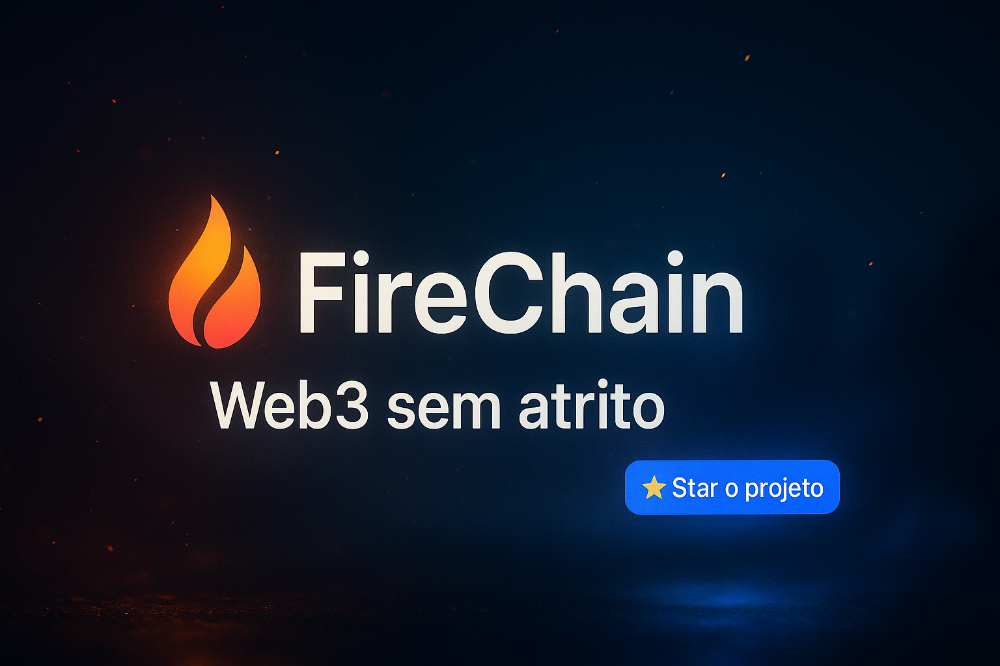

🔥 FireChain CLI - README Oficial v0.1.4
🧱 Modular • 🔐 Seguro • 🎨 UX Premium • 🧬 Criptografia Local

<p align="center">
  
</p>

---

<p align="center">
  
  
  
  
  
  
  
  
  
  
  
  
  
  
  
  
  
</p>

---

# 🔥 FireChain CLI

**🧱 Sua stack Web3 começa na linha de comando.**  
Interface de linha de comando modular, auditável e 100% offline para geração de carteiras **Bitcoin (₿), Ethereum (⛓️) e FireChain (🔥)** com arquivos `.wallet` criptografados, fingerprint único e UX premium.

---

## 📚 Índice

- [🧬 Sobre](#-sobre)
- [🔑 Princípios](#-princípios)
- [⚙️ Funcionalidades Atuais](#️-funcionalidades-atuais)
- [🧠 Execução Real em Produção](#-execução-real-em-produção)
- [🖥️ Ajuda Rápida](#️-ajuda-rápida)
- [🧱 Roadmap Técnico 2025](#-roadmap-técnico-2025)
- [📄 CHANGELOG Técnico](./CHANGELOG.md)
- [📄 Licenças e Contato](#-licenças-e-contato)

---

## 🧬 Sobre

A **FireChain CLI** é uma solução **ultra-segura**, escrita 100% em **Rust**, com foco em geração e controle local de carteiras Web3.  
**Sem conexão externa. Sem REST. Sem rastros.**

Ideal para:
- 🛠️ Desenvolvedores que dominam sua stack
- 🧪 Auditores e pentesters Web3
- 🔄 Automatizações com segurança total
- 🧬 Geração determinística e auditável de carteiras

---

## 🔑 Princípios

- 🔐 Criptografia de ponta-a-ponta (AES-GCM, Argon2id, HMAC)
- 🧬 Identidade única com `fingerprint` + `wallet ID`
- 🌐 Totalmente offline e local
- 🎯 Interface com UX premium e feedback visual
- ✅ Testes reais com `assert_cmd` e cobertura total via `llvm-cov`

---

## ⚙️ Funcionalidades Atuais

- ✅ Geração de par de chaves com `secp256k1`
- ✅ Proteção por senha derivada via Argon2id
- ✅ Criptografia AES-256-GCM + HMAC-SHA256
- ✅ Identidade verificável com fingerprint (`FC-xxxx`)
- ✅ Exportação e recuperação com `.wallet` seguro
- ✅ Derivação de múltiplos endereços (₿, ⛓️, 🔥)
- ✅ UX premium com `colored`, `termcolor` e feedback semântico
- ✅ CLI organizada por subcomandos (`new`, `derive`, `export`, `recover`)
- ✅ Testes automatizados, cobertura 100%

---

## 🧠 Execução Real em Produção

```bash
$ firechain-cli new --password "segredo123"
🔐 Iniciando criação da carteira FireChain...
✅ Carteira criada e criptografada com sucesso!
📁 Arquivo salvo em: fc8d7e...43.wallet
```

```bash
$ firechain-cli derive --all
✅ Derivação concluída!
₿ BTC: 1ABC...
⛓️ ETH: 0xabc...
🔥 F1R3: f1r3xyz...
```

```bash
$ firechain-cli export --input fc8d7e...43.wallet --out backup.wallet
📦 Carteira exportada com sucesso!
```

```bash
$ firechain-cli recover --input backup.wallet
♻️ Carteira recuperada e pronta para uso!
```

---

## 🖥️ Ajuda Rápida

```bash
$ firechain-cli --help
USAGE:
    firechain-cli <COMMAND>

COMMANDS:
    new       🔐 Cria nova carteira FireChain
    derive    🔭 Deriva endereços Web3
    export    📁 Exporta carteira segura
    recover   ♻️ Recupera carteira
```

---

## 🧱 Roadmap Técnico 2025

| Funcionalidade                        | Status        |
|--------------------------------------|---------------|
| Exportação `.wallet` criptografada   | ✅ Concluído  |
| Subcomandos `export`, `recover`      | ✅ Concluído  |
| Suporte a `--json` para integração   | 🔲 Planejado  |
| Importação por chave privada         | 🔲 Planejado  |

---

## 📄 CHANGELOG Técnico

Ver histórico técnico e refatorações:  
🔗 [Ver CHANGELOG.md](./CHANGELOG.md)

---

## 📄 Licenças e Contato

### 🔓 Licença Livre (MIT)

🔗 [LICENSE.md](./LICENSE.md)

### 💼 Licença Comercial FireChain™

🔗 [COMMERCIAL_LICENSE_FIRECHAIN.md](./COMMERCIAL_LICENSE_FIRECHAIN.md)

### 🔐 Política de Segurança Técnica

🔗 [SECURITY.md](./SECURITY.md)

---

## 🔗 Repositório

🔗 https://github.com/firechainmainnet/fire-wallet-cli

---

### 🤝 Contato Oficial

👤 Guilherme Lima — Arquiteto da FireChain CLI  
🔗 https://www.linkedin.com/in/guilhermelimadev-web3/
